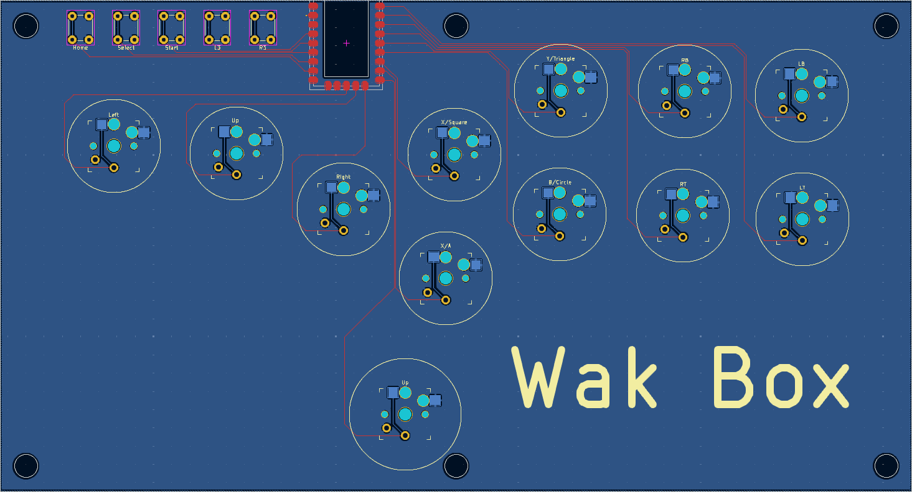
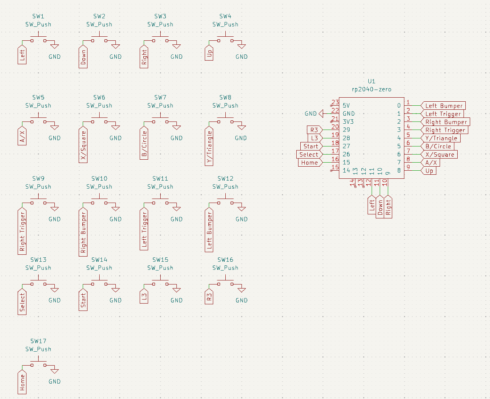

# WakBox

A RP2040 powered hitbox style controller PCB, housing, and firmware built by me.

### Required Materials
- PCB
- Case/Housing
- 6 Heat set sockets
- 6 screws (type TBA)
- 5 6x6x5 mm tactile switches
- 12 kailh choc 2 switches
- 11 24mm pushbutton keycaps
- 1 30mm pushbutton keycap 

## PCB

## Schematic

